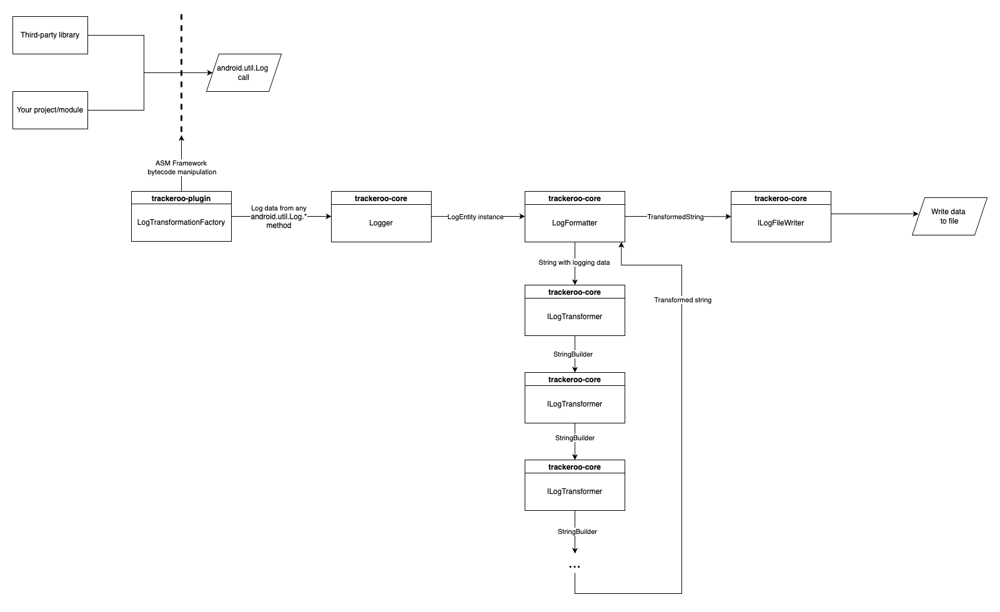

## Trackeroo
[](https://jitpack.io/#crazytosser00/trackeroo)

### How it works

This is an all-in-one tracking, logging and storing library for Android projects. You only need to add
library in your project and initialize it with builder. Trackeroo affects not only your code but
also third-party libraries too (like Glide, Timber, Cicerone and so on)

**Warning!! Project currently in progress and available in early beta and may not work in some cases**

#### Scheme of library


### Key features

#### Currently available:

* `android.util.Log` interception and storing - all logs in the app would be proxying and written in
  file includes the logging data that creates by another logging libraries (i.e Timber)
* Hooking `android.view.View.OnClickListener` and `android.view.View.OnScrollChangeListener` calls wherever in your code and logging it automatically
* Transforming log strings and adding meta data like timestamp, debug level or any specific info you
  want to store
* Share log files via the system pop-up to the apps on your device (Mail client, Telegram, Google Drive etc.)
* Customize library: you may create your own log transforms, file publishers, add support for another file extensions

#### Planning features:

* Hooking scrolls, double clicks, long clicks (already added)
* Hooking fragment stack (also for Compose Navigation)
* Log file size limit and auto-removing old data (already added)
* Publish modules for Google Drive and Yandex.Disk
* Publish module for Telegram (to automatically send file to the chat)
* Custom rules for auto-publishing (only for crashes for now)
* More configs for customize

### How to use

Add Jitpack to your buildscript repos and also add [Trackeroo-plugin](https://github.com/crazytosser00/trackeroo-plugin) dependency in app module.
Current latest version of plugin is `0.2.1-alpha`

```groovy
buildscript {
    repositories {
        maven { url "https://jitpack.io" }
    }

    dependencies {
        classpath("com.github.crazytosser00:trackeroo-plugin:$plugin_version")
    }
}
```

Next, add Trackeroo-core library dependency

```groovy
dependencies {
    implementation "com.github.crazytosser00:trackeroo:$library_version"
}
```

Then you need to init Trackeroo. In your Application class you should create `Logger.Builder` instance and
customize its configuration

```kotlin
override fun onCreate() {
    super.onCreate()
    Logger
        .init()
        .setLogFormatter(LogFormatter())
        .addLogTransformer(DebugLevelTransformer())
        .addLogTransformer(TimeTransformer())
        .addLogTransformer(MessageTransformer())
        .setLogPublisher(ExportLogPublisher(applicationContext))
}
```

Or you may just use default config

```kotlin
override fun onCreate() {
    super.onCreate()
    Logger.default(applicationContext)
}
```

**More about detailed configuration you can [find here](docs/basic-configuration.md)**

And that's it! Trackeroo will handle `android.util.Log` and view clicks.

Also you may manually add data to your log file. `Logger` class duplicates all logging methods
from `android.util.Log`.

To export log file you should call `Logger.publish()`. By default this method will open system
dialog with apps list to share. But you may change behavior by implementing `ILogPublisher` and
changing ExportLogPublisher in library config.

### Migrating from other logging libraries

No migrations are required in most cases. Trackeroo handles all `android.util.Log` calls in your project and third-party libraries using [ASM Framework](https://asm.ow2.io/). So if your current logger uses this methods, you can keep it without any changes in code files

### Useful features

**More about library functionality you can [find here](docs/basic-using.md) (section under construction yet)**


